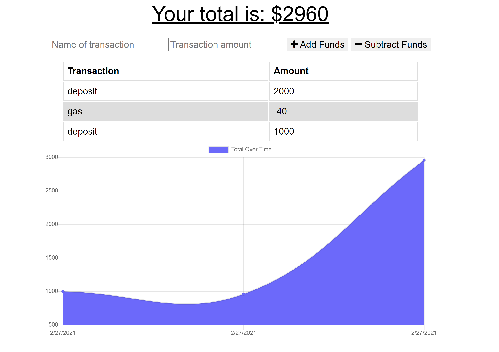

# Online-Offline-Budget-Trackers

Project link: [project page](https://budgettracker12345.herokuapp.com/)

Github-page: [github-pages](https://github.com/lillianhuynh/Online-Offline-Budget-Trackers)

## Table of Contents

* [About the Project](#about-the-project)
  * [Built With](#built-with)
* [Getting Started](#getting-started)
  * [Prerequisites](#prerequisites)
  * [Installation](#installation)
* [Usage](#usage)
* [Roadmap](#roadmap)
* [Contributing](#contributing)
* [License](#license)
* [Contact](#contact)


## About The Project



 Giving users a fast and easy way to track their money is important, but allowing them to access that information anytime is even more important. Having offline functionality is paramount to our applications success.


### Built With

* Bootstrap (CSS)
* Node JS
* MongoDB
* indexDB

## Getting Started

To get a local copy up and running follow these simple steps.

### Installation

1. Clone the repo
```sh
git clone https://github.com/github_username/repo_name.git
```

## Usage

The user will be able to add expenses and deposits to their budget with or without a connection.
Offline Functionality:

  * Enter deposits offline

  * Enter expenses offline

When brought back online:

  * Offline entries should be added to tracker.


## Roadmap

See the [open issues](https://github.com/lillianhuynh/Online-Offline-Budget-Trackers/issues) for a list of proposed features (and known issues).

## Contributing

Contributions are what make the open source community such an amazing place to be learn, inspire, and create. Any contributions you make are **greatly appreciated**.

1. Fork the Project
2. Create your Feature Branch (`git checkout -b feature/AmazingFeature`)
3. Commit your Changes (`git commit -m 'Add some AmazingFeature'`)
4. Push to the Branch (`git push origin feature/AmazingFeature`)
5. Open a Pull Request

## License

N/A

## Contact

Lili Huynh- lillianhuynh312@gmail.com

Project Link: [https://budgettracker12345.herokuapp.com/](https://budgettracker12345.herokuapp.com/)